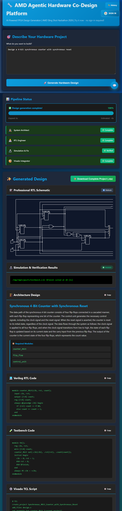
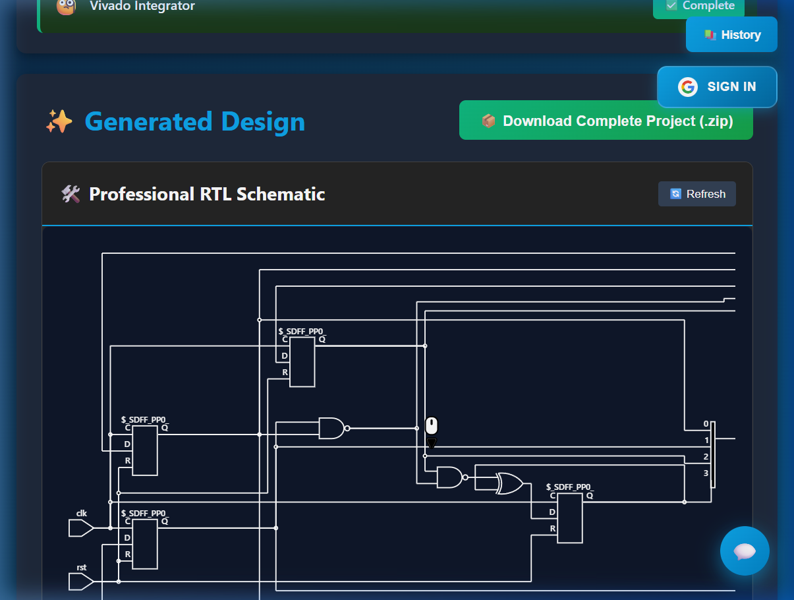
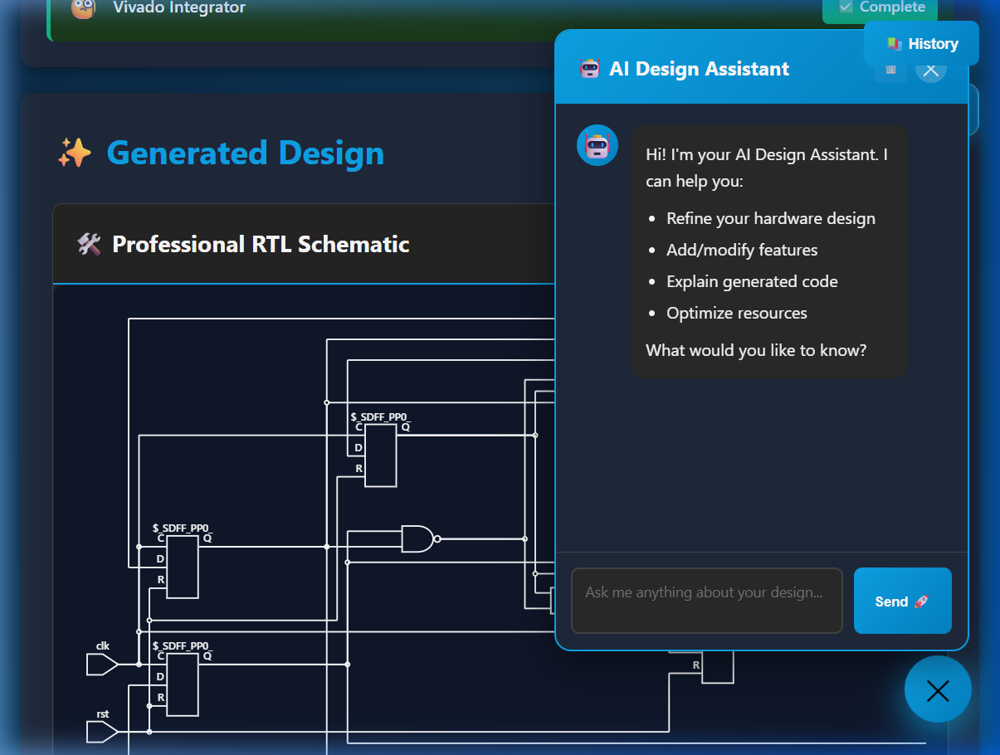

# 🌟 AMD Agentic Hardware Co-Design Platform
### **AMD Sling Shot Hackathon 2026 - Innovation Category**

<div align="center">
  
  
  
</div>

---

## 🚀 Vision
The **AMD Agentic Hardware Co-Design Platform** is a cutting-edge, industrial AI ecosystem designed to accelerate the development of next-generation hardware on **AMD Xilinx FPGAs and Adaptive SoCs**. By leveraging a multi-agent AI pipeline, we transform complex natural language requirements into synthesizable, verified RTL in seconds.

---

## 📸 Interface Preview

<div align="center">
  <h3>Professional RTL Design & Verification</h3>
  
  <p><em>Multi-agent pipeline showcasing Architecture, Verilog, and Simulation results.</em></p>
  
  <br/>
  
  <div style="display: flex; justify-content: space-around; gap: 10px;">
    <div style="width: 48%;">
      <h4>🎨 High-Contrast RTL Schematic</h4>
      
    </div>
    <div style="width: 48%;">
      <h4>🤖 AI Design Assistant</h4>
      
    </div>
  </div>
</div>

---

## 💎 Elite Features

### **🧠 3-Tier Agentic Architecture**
- **System Architect Agent**: High-level block diagram and architecture specs.
- **RTL Engineer Agent**: Verilog HDL generation & automated testbench creation.
- **Xilinx Integrator Agent**: Automated Tcl build scripting and resource optimization.

### **🔧 Professional Engineering Toolchain**
- **verification**: Integrated `iverilog` simulation with real-time log analysis.
- **Synthesis**: Gate-level netlist generation using **Yosys**.
- **Visualization**: High-Contrast, professional RTL Schematics via **Netlistsvg**.

### **☁️ Cloud-Native Persistence**
- **Google Sign-In**: Secure access for industrial hardware projects.
- **Sync-History**: Full chat and project persistence with **Firebase Firestore**.

### **📱 Ultra-Responsive Design**
- **Modern UI**: A premium glassmorphic interface built with Vanilla JS and CSS3.
- **Mobile-Ready**: Design and preview hardware code directly from your smartphone.

---

## 🛠️ The Tech Stack

-   **Backend**: Python / Flask (containerized with Docker)
-   **AI Intelligence**: 
    -   **Primary**: Google Gemini 2.0 Flash
    -   **Failover**: Groq Llama 3.1 70B (Ultra-fast inference)
-   **Infrastructure**: Render / Firebase / GitHub actions

---

## 🎯 Target Platform: AMD Xilinx Ecosystem
This platform is optimized for the **AMD Artix-7, Kintex-7, and Zynq** families. It generates industrial-standard RTL and Tcl build scripts ready for **Xilinx Vivado ML Edition**.

---

## 🚀 Quick Launch

### **Cloud (Live)**
Visit our live production instance at: **[amd-hardware-agent.onrender.com](https://amd-hardware-agent.onrender.com/)**

### **Local Setup**
```bash
# 1. Clone
git clone https://github.com/Bhavin-umatiya/AMD_hack.git

# 2. Install
pip install -r requirements.txt

# 3. Secure
# Create .env and add: GEMINI_API_KEY & GROQ_API_KEY

# 4. Start
python app.py
```

---

## 👨‍💻 Project Team
- **Bhavin Umatiya** (Lead AI/Full-Stack Engineer)


---
<div align="center">
  <p>Built for the <strong>AMD Sling Shot Hackathon 2026</strong>. Innovating the future of Agentic Silicon Design.</p>
</div>
